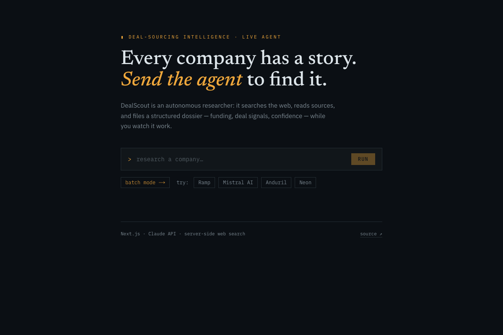

# DealScout — AI Company Research Agent

An autonomous research agent for deal sourcing. Type a company name and the agent
searches the web, reads sources, and returns a **structured company profile**
(industry, funding, deal signals, confidence rating) — while you watch its steps
stream in real time.

> Built to productionize a workflow I did manually as an AI Solutions Engineer
> intern at an M&A/investment firm: enriching company profiles for deal-sourcing
> pipelines.

**Live demo:** https://dealscout-gamma.vercel.app (rate-limited to a few runs per visitor per day)



## How it works

```
Browser ──POST /api/research──▶ Next.js Route Handler (streams NDJSON events)
                                       │
                                       ▼
                              Agent loop (lib/agent.ts)
                                       │  Claude API (claude-opus-4-8)
                                       ▼
              ┌─────────────────── tools ────────────────────┐
              │ web_search / web_fetch (server-side,         │
              │ run on Anthropic's infra — no scraper here)  │
              │ save_profile (custom, strict JSON schema)    │
              └──────────────────────────────────────────────┘
```

1. The route handler validates input, applies a per-IP daily rate limit, and opens
   a streaming response (newline-delimited JSON events).
2. `runResearchAgent` drives the agent loop: Claude plans, calls the **server-side
   web search / web fetch tools** (they execute on Anthropic's infrastructure, so
   the app needs no search-API key), and narrates progress.
3. When the model believes research is done, it calls the custom **`save_profile`
   tool**, whose `strict: true` JSON schema guarantees the profile parses — no
   "hope the model emits clean JSON" fragility.
4. The UI renders three live panes: agent activity (tool usage), narrated notes
   (streamed text), and the final profile card.

## Design decisions

- **Hand-rolled agent loop, no framework.** The loop is ~100 lines
  (`lib/agent.ts`) and handles the three stop reasons that matter:
  `pause_turn` (server-side tool loop needs to be resumed — re-send as-is),
  `tool_use` (our custom tool fired — capture input, return a `tool_result`),
  and `refusal`/`end_turn` (terminate). Owning the loop makes behavior
  debuggable and the interview story explainable.
- **Structured output via a strict tool instead of prose JSON.** `strict: true`
  on the tool schema makes the API validate the arguments, so `block.input` can
  be trusted as a typed `CompanyProfile`.
- **Streaming end-to-end.** Research takes tens of seconds; the Anthropic SDK
  stream is translated into app-level events (`status` / `thinking` / `text` /
  `profile`) and piped to the browser as NDJSON over a `ReadableStream`.
- **Demo-mode cost guardrails.** Per-IP daily cap (in-memory). Known limitation:
  on serverless each warm instance keeps its own counter, so the effective cap is
  `limit × instances` — acceptable for a portfolio demo; the production fix is a
  shared store (Upstash Redis). `max_uses` on the web tools also bounds per-request
  spend.
- **Model and effort are configurable** (`DEALSCOUT_MODEL`, `DEALSCOUT_EFFORT`),
  defaulting to `claude-opus-4-8` / `medium` effort. The effort knob exists
  because a model swap silently changes the latency profile: Sonnet at default
  effort researched past Vercel's 300s function limit; at `medium` effort with
  tighter search budgets the same run fits with room to spare.
- **Batch mode** (`/batch`): up to 10 companies researched sequentially with
  per-row status and CSV export.
- **MCP server** (`/api/mcp`): the agent is also exposed as a Model Context
  Protocol tool (`research_company`), so any MCP client — Claude Desktop, IDEs,
  other agents — can use DealScout as a capability. The endpoint is a
  hand-rolled, stateless Streamable-HTTP JSON-RPC handler (~100 lines, no SDK):
  `initialize` / `tools/list` / `tools/call`, with tool failures reported via
  `isError` inside the result so the calling model can react to them.
  Connect with: `{"type": "http", "url": "https://dealscout-gamma.vercel.app/api/mcp"}`

## Run locally

```bash
npm install
cp .env.example .env.local   # add your ANTHROPIC_API_KEY
npm run dev
```

## Tech

Next.js 16 (App Router) · TypeScript · Tailwind CSS · Anthropic SDK
(`@anthropic-ai/sdk`) · deployed on Vercel

## Evaluation

`eval/` holds an accuracy suite: hand-checked ground truth for stable fields
(website domain, founded year, HQ city) and a grader script. Latest run:
**15/15 fields correct** across 5 companies — see [eval/RESULTS.md](eval/RESULTS.md).
Reproduce with `node eval/run-eval.mjs`.

## Roadmap

- [x] Batch mode (`/batch`): paste a list of companies, get a CSV back
- [x] MCP server exposing the agent to any MCP client (`/api/mcp`)
- [x] Evaluation suite (accuracy vs. hand-checked ground truth — `eval/`)
- [ ] Persist profiles to Postgres (Neon) with a history view
